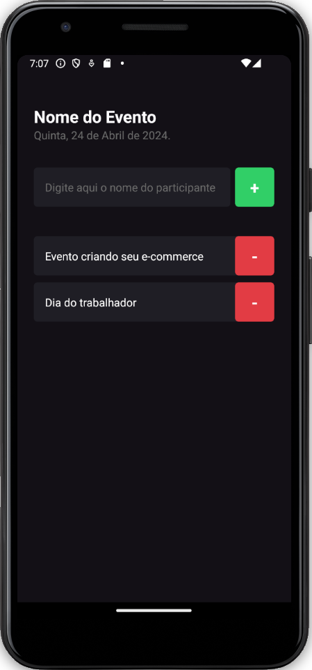

<h1 align="center">
  ImHere APP
</h1>

<p align="center">
  A Manager event app
</p>


<p align="center">
  <a href="#-technologies">Technologies</a>&nbsp;&nbsp;|&nbsp;&nbsp;
  <a href="#-getting-started">Getting started</a>&nbsp;&nbsp;|&nbsp;&nbsp;
  <a href="#author">Author</a>
</p>


<p align="center">
  
</p>

<p align="center">
  
  
<!--    -->
</p>

<br>

## 🧰 Technologies
Here are the technologies used in this project

- React Native 0.73.6
- Expo 50.0.14
- React 18.2.0
- TypeScript 5.1.3
---

# 💻 Getting started
Here are the commands and steps on how to start the project.
---

***Dependency***

NodeJS
NPM (Package manager of your choice)

<br/>

---

Install the dependencies using a package manager, the one used in the project was NPM.
```
npm install
```

To start the project on your machine using NPM.

```
npx expo start
```

---

## Author
Made with ♥ by Apolo Wilker 🚀 <a href="https://github.com/APOLOWILKER" target="_blank">Apolo Wilker</a>
